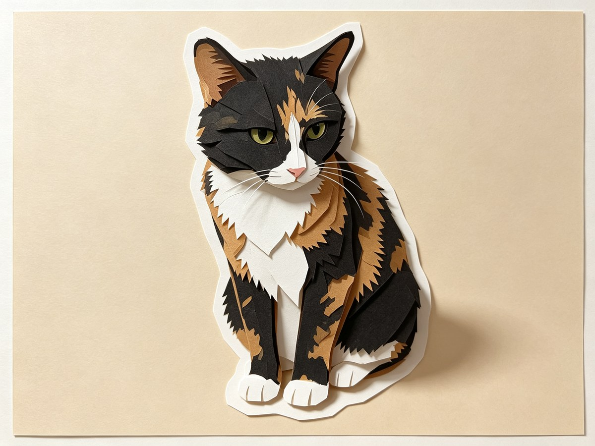
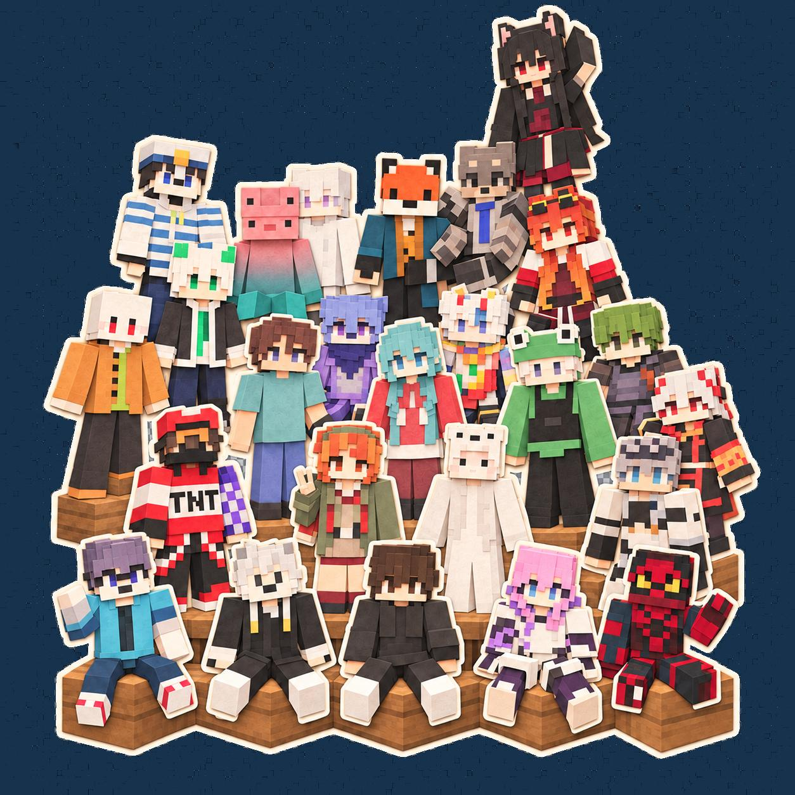

# paper-cut-illustration · 剪纸插画 skill

**发一张照片，收一尊纸雕。**

[](https://github.com/kelegele/paper-cut-illustration-skill/stargazers)
[](LICENSE)


AI 画过一万张「剪纸风」，没有一张真记得你家猫。这个 skill 反着来：你发一张照片，说一句「剪纸插画，1:1，透明底」，它只补问缺的选项，然后把仓库里逐字锁定的英文母版提示词**全文**连同照片一起交给生图工具；要透明底，就先出一张纯色底图，再用自带脚本在你本机抠成真正的透明 PNG——不是棋盘格假透明。交稿前它核对画布比例、透明通道、五官与服饰层次，通过了才以新文件名存进 `output/`，绝不覆盖上一张。



## 我为什么做了它

> 我一直想把宠物照片里那些可爱的瞬间保存成更实体的东西——比如一枚剪纸风的冰箱贴，贴在每天开门就能看到的地方。
>
> 没有这套流程的时候，我只能在 ChatGPT 里反复调教：说「像剪纸一点」，细节就丢了；说「细节留住」，剪纸感又没了。最崩溃的是那圈暖白模切边——整个贴纸质感的来源——无论怎么调教都出不来，出来了也是歪歪扭扭。
>
> 后来我把踩过的坑固化成这个 skill：母版提示词逐字锁进仓库，不用再调教，也能原样分享给任何人；比例和背景收成两个选项，动嘴一句话就能说清；描边写死在母版里，交付前还会逐项核对。它拿不出手的东西会老实说，而不是糊弄一张。

## 30 秒开始

安装：

```bash
npx skills add https://github.com/kelegele/paper-cut-illustration-skill -a claude-code --copy -y
```

然后对支持 skill 的 agent 说：

> 用 paper-cut-illustration 把这张照片做成剪纸插画。1:1，透明背景，我要拿去做冰箱贴。

也可以把仓库地址直接发给它代装：

> 帮我安装这个 skill：https://github.com/kelegele/paper-cut-illustration-skill ，装好后告诉我怎么用。

抠图脚本需要 [uv](https://docs.astral.sh/uv/)，首次运行自动准备 Pillow；不需要生图 API Key。

## 它能帮你做什么？

| 你手里的东西 | 它会怎么处理 |
| --- | --- |
| 一张半身照 | 保持半身取景；不为「全身」要求补画不存在的腿 |
| 一张合影 | 你指定做哪一位；要全队就说明保留人数与站位 |
| 一句话「1:1，透明底」 | 只补问缺的选项；比例是画布留白适配，不拉伸、不裁头 |
| 想要能贴的冰箱贴、贴纸 | 先出均匀纯色底图，本机脚本抠成真 RGBA 透明 PNG |
| 网页版生图，没接本地工具 | 给你完整提示词全文，复制到任何平台，做完拿回来继续 |
| 猫狗等非人物照片 | 先说明母版以人物为对象，经你同意加适配指令再动手 |
| 第一张不够像 | 对照原图清单查五官、服饰、配饰、手部，自动修正一次 |

## 为什么不是直接让 AI 画一张？

周五晚上十点，你翻到猫打哈欠的那张照片，想做成剪纸风发出去。你把它丢给手边的 AI，开始赌运气：第 5 张风格变了，第 12 张耳朵被裁掉一半，第 20 张终于像样——可那圈暖白模切边还是出不来。十一点半，你还差一张能看的图。

这还算顺利的。真正贵的是每次从零调教：上一次磨出来的提示词躺在某个聊天记录里，换个会话就找不到了；朋友问你要，你翻了十分钟记录，最后回一句「你自己试改改」。

做出来的呢？躺在下载文件夹里，叫 `image(17).png`。下一版一生成，顺手就把它覆盖了。

套滤镜？那是整图调色，没有纸层、没有折痕、没有模切边，是平涂不是纸雕。手写提示词？人物和宠物每张都在变脸，风格永远对不齐。在线一键抠图？发丝和镂空糊成一片，还得先把照片交给陌生的服务器。

## 怎么说，比较容易一次做好？

**做一枚冰箱贴**

> 用 paper-cut-illustration 把这张照片做成剪纸插画。1:1，透明背景，我要拿去做冰箱贴。

**换比例换底色**

> 剪纸小人，4:3，背景 #DCEAF7。

**宠物照片**

> 这张猫咪照片也能做成剪纸插画吗？保持它打哈欠的姿势。

**微调与修正**

> 透明边缘有一点绿色残留，把 tolerance 调小再出一版，别覆盖上一张。

## 从照片到成品

1. **看图。** 打开你的照片，记下表情、姿势、服饰层次和取景范围。
2. **问缺不问全。** 比例（1:1 / 4:3 / 16:9）和背景（纯色 / 指定色 / 透明）没说清的才问，一句话答完。
3. **原文出发。** 从逐字锁定的英文母版全文出发，你的要求只作独立补充附在后面，原文永不改动。
4. **生图。** 照片与全文一起交给生图工具；半身照保持半身，合影按你点名的来。
5. **抠透明。** 选了透明底：先出均匀纯色底图，本机色键脚本抠成真 alpha；镂空内孔用坐标显式指定，不瞎删。
6. **验货。** 读实际像素核对比例，查透明通道是否真透明，不凭扩展名下结论。
7. **修一次。** 对照原图逐项检查五官、服饰、配饰、手部；有明显偏差自动修正一次，不无限重 roll。
8. **落盘。** 以新文件名存进 `output/`，你的每一版都在。

## 最后你会得到什么？

- 一张所选比例的成品 PNG：分层卡纸质感、暖白模切边、柔和阴影齐全。
- 选透明时，一张真正的 RGBA 透明 PNG——贴到深色背景上就知道，没有棋盘格：



- 没接生图工具时，一份完整提示词文本，复制去任何平台都能用。
- 全部成品以不重复的文件名收在 `output/`，历史每一版都还在。

每一张都经过像素与特征核对才交付；哪些已验证、哪些还需你亲眼确认，它会如实说。

## 安装

见开头 [30 秒开始](#30-秒开始)；或把仓库地址直接丢给你的 agent。

## 常见问题

**只能做人物吗？**

母版提示词以人物服饰为对象。丢来猫狗等非人物，它会先说明并征得你同意，再加适配指令——上面的猫咪冰箱贴就是这么来的。

**透明背景是生图工具直接给的吗？**

不是。生图阶段不要求透明通道：先出一张均匀纯色底图，再用本机脚本抠出真 alpha。棋盘格底图、复杂背景不适合脚本，它会要求重做底图，而不是硬抠糊弄。

**我的照片会被传到哪里？**

只交给你自己选定的生图工具。这个仓库没有服务端，抠图在你本机完成。

**和剪纸风滤镜有什么区别？**

滤镜是整图调色；这里是重构：分层卡纸、模切边、可校验的比例与透明通道，外加对你照片特征的保留清单。

**不满意会一直重画吗？**

不会。对照原图最多自动修正一次生图、两次脚本参数微调；再不行它会直说问题，不假装成功。

## 仓库里有什么？

```text
paper-cut-illustration/SKILL.md     工作流、生成前选项、检查与交付规则
paper-cut-illustration/references/  英文母版提示词（逐字锁定）与透明工作流
paper-cut-illustration/scripts/     色键抠图脚本（PEP 723，uv 直跑）
tests/                              抠图脚本行为测试
```

维护者跑测试：

```bash
uv run --with "Pillow>=10,<13" python -m unittest discover -s tests -v
```

## 反馈

欢迎在 [Issues](https://github.com/kelegele/paper-cut-illustration-skill/issues) 提问题、晒成品、提建议。

## License

[MIT](LICENSE) © 2026 kelegele
